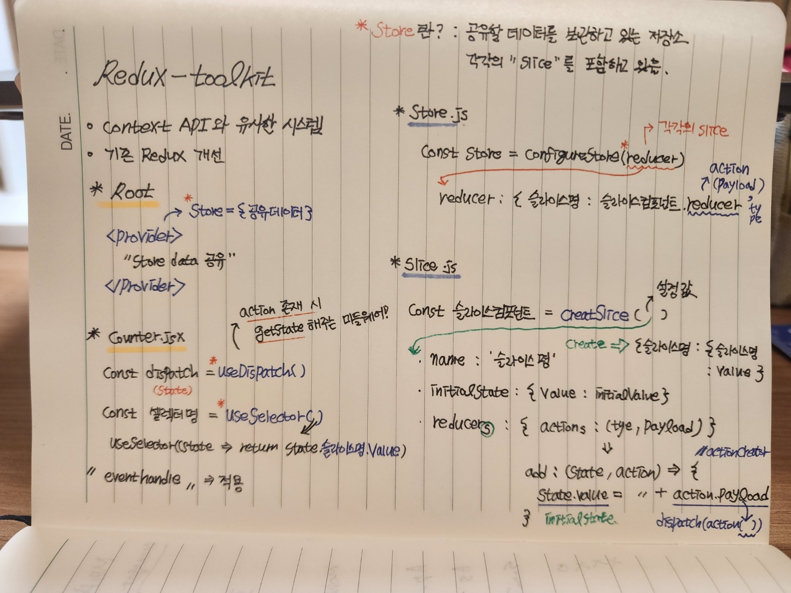

# Redux-toolkit

## 리덕스 툴킷 학습 내용📝



</br>
</br>

## 리덕스 툴킷이란?

---

기존의 Redux의 복잡한 로직을 단순화한 New-Redux 프로그램이다

### 특징은?

"내가 이해한 바, context API와 유사한 동작방식으로 개선 된 것 같다"

예시를 통해서 동작 원리를 알아보자

### Root

기본 세팅 값은 리덕스툴킷 라이브러리에 따른다.
Context API 처럼 전달할 데이터를 "store"에 생성한 뒤(configureStore),
Provider를 통해 데이터를 공유할 범위에 우산을 씌워 props를 전달한다

```jsx
import { Provider } from 'react-redux';
import './App.css';
import Counter from './components/redux-toolkit/Counter';
import store from './components/redux-toolkit/store';

function App() {
    return (
        <div>
            {/* store가 slice들을 가지고 있으므로 사용할 컴포넌트를 우산씌워야함 */}
            <Provider store={store}>
                <Counter />
            </Provider>
        </div>
    );
}

export default App;

// 리덕스 툴킷은 store안에 slice들을 나눠서 저장한다
// 과거 리덕스는 store에 모든 정보들이 다 담겨있었음
```

### store

-   공유할 데이터를 생성하는 곳이다
-   데이터 생성은 configure methods를 통해 이뤄지고
-   configure는 파라미터로 각각의 slice를 갖는다
-   slice는 각각의 슬라이스컴포넌트의 reducer를 반영한다
-   여기서 reducer란, action(type, payload)를 일컫는 것이다
-   reducer는 slice.js에서 reducers의 정의를 그대로 따른다

[syntax]

```js
const store = configure(각각의slice);

각각의slice: {
    슬라이스명: 슬라이스컴포넌트.reducer;
}
// 슬라이스의 reducer
// reducer: Reducer<State>;

reducer: action(type, payload);
```

[practice]

```js
import { configureStore } from '@reduxjs/toolkit';
import { counterSlice } from './counterSlice';

// ** store에는 각각의 slice들이 들어가 있음 **

const store = configureStore({
    // 각각 slice들의 reduce들이 들어가야 함
    reducer: {
        // Naming 주의 : reducers ❌ , reducer 🟢

        // reducers 안에 있는 로직을 자동으로 만들어 줌
        counter: counterSlice.reducer,
    },
});

export default store;
```

### slice.js

-   슬라이스를 생성하는 곳이다
-   슬라이스 생성은 createSlice methods를 통해 이뤄지고
-   createSlice 파라미터로 슬라이스명, 초기값, \*리듀서(reducers)들을 갖는다
-   여기서 reducers란, store에 전달할 action(type, payload)를 생성한다

[syntax]

```js
const 슬라이스컴포넌트 = createSlice(설정값)

설정값 = {
    name : '슬라이스명',
    initialState : {value : 초기값 설정},
    reducers : {actions}

    actions = {
        type : (state,action ) => {
            // *redux와 다르게 state를 스프레드를 이용해서 복사하지 않아도 됨
           return state.value = state.value + action.payload
        }
    }
}

* state.value = initialState : {value : 이거 받아 옴}
* action.payload는 = dispatch(type(payload))로 컴포넌트에서 받아올 예정
```

[practice]

```js
import { createSlice } from '@reduxjs/toolkit';

// ** slice 생성(createSlice)
export const counterSlice = createSlice({
    name: 'counter',
    initialState: { value: 0 },
    reducers: {
        // actions 이름
        add: (state, action) => {
            console.log('state는 뭐냐?', state); // Proxy(object)
            console.log('state.value는 뭘 받냐?', state.value); // initialState 받음
            console.log(typeof initialState);

            // ...state, action 뭐시기 안 해도 됨!
            // 기존의 상태 값 = 기존의 상태 값 + 취할 액션

            // payload은 리덕스 툴킷에서는 actionCreator 생성
            state.value = state.value + action.payload;
            console.log('actionPayLoad:', action.payload);
        },
        substract: (state, action) => {
            // 기존의 상태 값 = 기존의 상태 값 - 취할 액션
            state.value = state.value - action.payload;
        },
    },
});
console.log('initialState :', counterSlice.initialState); // undefined
// state reducers에 대한 값은 reducer에서 처리

// actions export 시키기
export const { add, substract } = counterSlice.actions;
```

### Counter 컴포넌트

-   Counter 컴포넌트에서 실제 인터렉션이 되는 구간
-   dispatch를 통해 action이 존재하면 state를 받아온다
-   selector를 통해 slice의 value값과 동기화 시킨다
-   value값은 eventHandler를 통해 적용 시킨다

[syntax]

```jsx
const dispatch = useDispatch(); // action ? getState = state : ''

const 셀럭터명 = useSelector(슬라이스 state와 동기화)

// 동기화 작업

useSelector((state) => {
    return state.슬라이스명.value
})

// 이벤트 적용 구간
const handleEventHandler = (e) => {

    // ... 적용하고 싶은 이벤트 생성
    // UI 적용
}

```

[practice]

```jsx
export default function Counter() {
    const dispatch = useDispatch();
    console.log('dispatch는 뭐하는 녀석이냐?:', dispatch); // action이 존재하면 state를 불러오는 미들웨어

    // useSelector는 어디서 파생되었나?
    // 바로 reducer에서 return 값을 가져 온다.
    const count = useSelector((state) => {
        console.log('state', state); // {counter: {counter : value : }}}
        return state.counter.value;
    });
    console.log('useSelector(state)는 뭘 받아오냐?:', count);

    const handleDispatchCount = (e) => {
        if (e.target.id === 'addition') {
            dispatch(add(2));
        } else if (e.target.id === 'substraction') {
            dispatch(substract(2));
        }
    };

    return (
        <>
            <CounterButton id='addition' onClick={handleDispatchCount}>
                +
            </CounterButton>
            <Count>{count}</Count>

            <CounterButton id='substraction' onClick={handleDispatchCount}>
                -
            </CounterButton>
            <Count>{count}</Count>
        </>
    );
}
```
